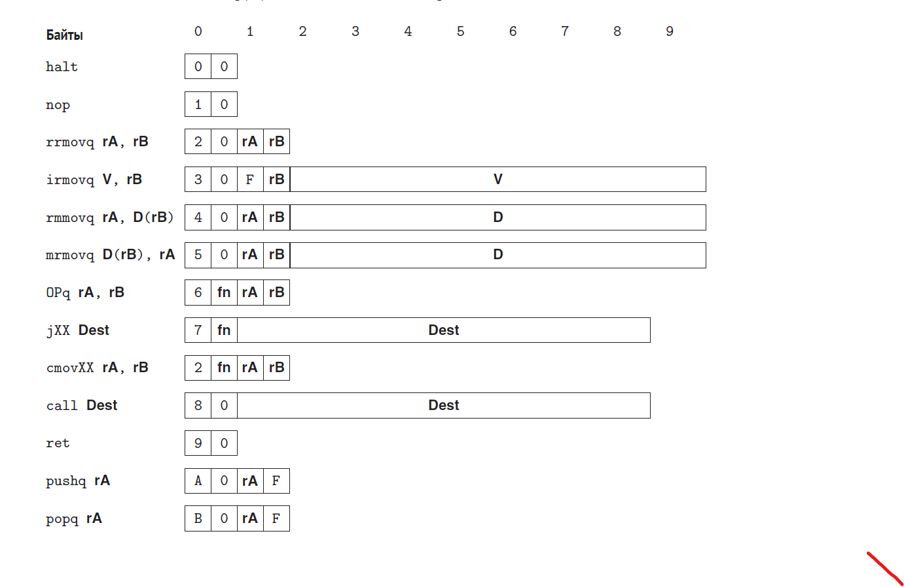
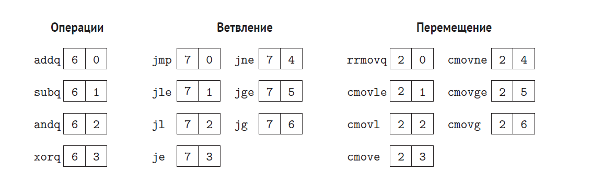

Реализация архитектуры Y86-64 при помощи библиотеки MyHDL.

#### Ветка SEQ - версия с последовательной обработкой инструкций

#### Ветка PIPE - версия с конвейерной обработкой инструкций

yasm.py - производит "Yassembling" переданного кода. 

Всего в этой архитетуре 15 регистров и команды кодируются фиксированной длиной. 

