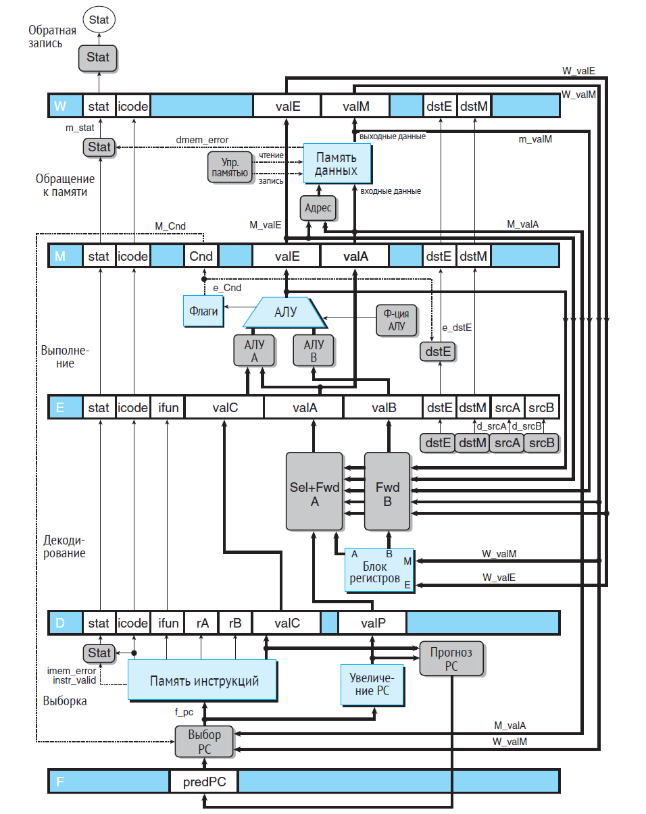

Версия архитектуры конвейреной обработкой инструкций. 

- Обработка разделена на этапы - Fetch, decoding, execution, memory access, write back.
- Данные передаются между этапами при помощи конвейерных регистров.
- Опасности по данным обрабатываются при помощи продвижения данных и остановки в случае данных из памяти.
- Branch prediction: условные перемещения - всегда перемещаться. ret - перемащаться по адресу из стека вызовов.
- Неверные предсказания обрабатываются без изменения состояния, видимого программисту. 

### Fetch
- Читает память по адресу PC, интерпретирует как инструкцию, извлекает из нее данные.
- Предсказывает адрес следующей инструкции: для условных перемещений - всегда перемащается, для return - адрес из call стека.
- Считывает сигналы из других этапов и устраняет ошибки предсказаний.
### Decoding
- По коду инструкции определяет регистры источники, регистры приемники и считывает нужные данные
### Execution
- Выполнет арифметические действия, выставляет флаги и определяет результат условного перемещения.
- Обрабатывает опасности по данным
### Memory access
- Читает и записывает в память данные
### Write back
- записывает в регистры вычисленные значения

  
